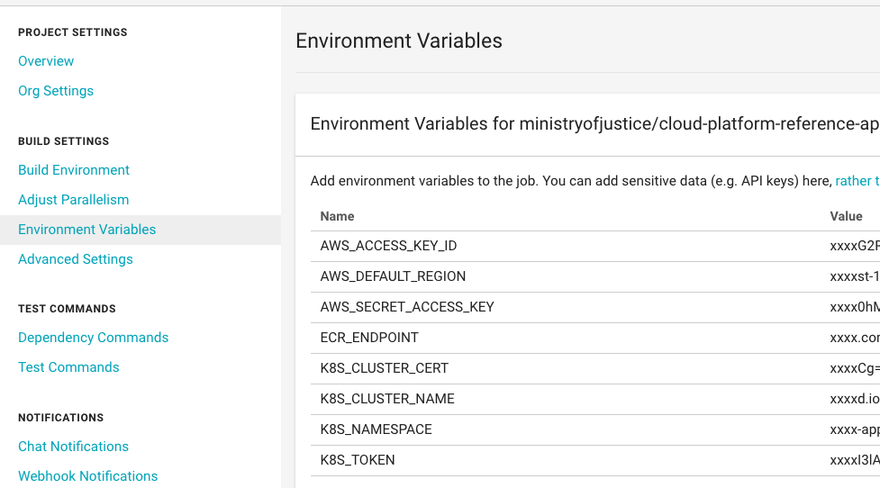

# Getting started on the MoJ Cloud Platform: Demo Application
This repository will contain the required files to follow along with the MoJ Digital [Getting Started](https://ministryofjustice.github.io/cloud-platform-user-docs/02-deploying-an-app/002-app-deploy-helm/#deploying-an-application-to-the-cloud-platform-with-helm), the intended outcome of this document is to allow you to run a basic Django web application on the MoJ Cloud Platform.

When discussing the MoJ Cloud Platform in this context, we're referring to a Kops deployed Kubernetes cluster hosted on AWS.

## Table of contents
   * [Installation with kubectl](#installing-with-kubectl)
   * [Developing and building the app locally](#local-development)
   * [Building, tagging and pushing to ECR](#pushing-to-ecr)

## Installing with kubectl
There are several ways to deploy applications onto the MoJ Cloud Platform, the below will show the simplest - kubectl.

### Prerequisites
* Install kubectl
```brew install kubectl```
* Install gettext
```brew install gettext```

* Authenticate
Gain access to a Cloud-Platform cluster by authenticating with your GitHub account using the instructions [here](https://ministryofjustice.github.io/cloud-platform-user-docs/01-getting-started/001-kubectl-config/#kubectl-configuration).

* Create namespace
Follow the instructions [here](https://ministryofjustice.github.io/cloud-platform-user-docs/01-getting-started/002-env-create/#creating-a-cloud-platform-environment) to create a namespace, an example output is in the `kubectl_deploy/namespace/` folder.
Once done, 2 environment variables must be exported:
`${K8S_CLUSTER_NAME}`, matching both the DNS and profile name for the cluster defined in `~/.kube/config`, usually `cloud-platform-live-0.k8s.integration.dsd.io`
`${K8S_NAMESPACE}`, matching the name created above

### TL;DR
```
# Clone repo
$ git clone git@github.com:ministryofjustice/cloud-platform-reference-app.git
$ cd cloud-platform-reference-app

# Apply Manifests
$  cat kubectl_deploy/postgres/*yaml | /usr/local/opt/gettext/bin/envsubst | kubectl --context ${K8S_CLUSTER_NAME} apply -f -
$  cat kubectl_deploy/django/*yaml | /usr/local/opt/gettext/bin/envsubst | kubectl --context ${K8S_CLUSTER_NAME} apply -f -

# Ensure app is running
$ kubectl --context ${K8S_CLUSTER_NAME} get pods -n ${K8S_NAMESPACE}

# Grab URL and test in browser of your choice
$ kubectl --context ${K8S_CLUSTER_NAME} get ingress -n ${K8S_NAMESPACE}

# Delete app when done
$  cat kubectl_deploy/django/*yaml | /usr/local/opt/gettext/bin/envsubst | kubectl --context ${K8S_CLUSTER_NAME} delete -f -
$  cat kubectl_deploy/postgres/*yaml | /usr/local/opt/gettext/bin/envsubst | kubectl --context ${K8S_CLUSTER_NAME} delete -f -
$ kubectl --context ${K8S_CLUSTER_NAME} get pods -n ${K8S_NAMESPACE} # you should have nothing running
```
## Local development
### Prerequisites
* python >= 3.6

* pip

* virtualenv (optional)

### Installation

#### Creating the environment

Create a virtual python environment for the project. If you're not using virtualenv or virtualenvwrapper you may skip this step.

#### For virtualenvwrapper
```mkvirtualenv {{ project_name }}-env```

#### Clone the code
```git clone git@github.com:ministryofjustice/cloud-platform-reference-app.git {{ project_name }}```

#### Install requirements

This step also creates githooks which will run all the necessary tests before allowing to commit.

```make prepare```

If installation of githooks isn't necessary you can run

```pip install -r requirements.txt```

#### Running

```python django_reference_app/manage.py runserver```

Open browser to [http://127.0.0.1:8000](http://127.0.0.1:8000)
#### Running tests

```make test```

## Pushing to ECR
### Prerequisites
* Docker
```brew install docker```

* AWS CLI
```brew install awscli```

The decision was made to use the Amazon Elastic Container Registry. ECR is a fully-managed [Docker](https://aws.amazon.com/docker/) container registry that makes it easy for developers to store, manage, and deploy Docker container images.

A repository has been created on the AWS account *'mojds-platform-integrations'* called *'arn:aws:ecr:eu-west-1:926803513772:repository/cloud-platform-demo-app'*.

### Building, tagging and pushing to ECR
1) Retrieve the `docker login` command that you can use to authenticate your Docker client to your registry:

```aws ecr get-login --no-include-email --region eu-west-1```

2) Run the `docker login` command that was returned in the previous step.

3) Build your Docker image using the following command.

```docker build -t cloud-platform-demo-app .```

4) After the build completes, tag your image so you can push the image to this repository:

```docker tag cloud-platform-demo-app:latest 926803513772.dkr.ecr.eu-west-1.amazonaws.com/cloud-platform-demo-app:latest```

5) Run the following command to push this image to your newly created AWS repository:

```docker push 926803513772.dkr.ecr.eu-west-1.amazonaws.com/cloud-platform-demo-app:latest```

### CircleCI build/push/deploy

Following every commit to the master branch a job kicks off, which builds the Dockerfile on root, tags/pushes to ECR and deploys the reference application on the Cloud Platform.

The configuration for this job is in the directory `.circleci/config`.

A set of env vars must be defined for Circle to access the ECR and K8s cluster:

